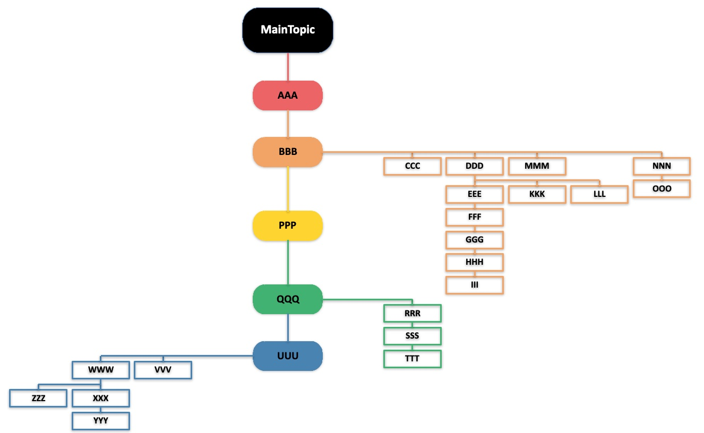

# Markdown to PPTX Mind Map Generator

This project leverages the `python-pptx` library to create PowerPoint presentations with mind maps based on input from Markdown-formatted documents. It streamlines the process of converting structured text into visually engaging slides.

## Features

- **Markdown Input**: Use simple Markdown syntax to define the structure of your mind map.
- **Automated PPTX Creation**: Generate PowerPoint presentations programmatically with `python-pptx`.
- **Hierarchical Mind Map**: Convert Markdown headers and lists into a clear, hierarchical mind map.

## Installation

1. Clone the repository:

   ```bash
   git clone https://github.com/mengyang0529/ppt_art.git
   cd ppt_art
   ```

2. Install the required dependencies:

   ```bash
   pip install -r requirements.txt
   ```

## Usage

1. Create a Markdown file (e.g., `example.md`) with the desired content structure:

   ```markdown
    - MainTopic    
        - AAA
        - BBB
            - CCC
            - DDD
                - EEE
                    - FFF
                    ...
   ```
   
   Note: The first level of indentation is used to define the hierarchy of the mind map.
         And there is only one level of MainTopic.
2. Run the script to generate the PowerPoint file:

   ```bash
   python demo.py -i example.md -o output.pptx
   ```

3. Open the generated `output.pptx` file in PowerPoint to view your mind map.


## Dependencies

- Python 3.12+
- `python-pptx`

Install additional dependencies using:

```bash
pip install python-pptx
```

## Contributing

1. Fork the repository.
2. Create a new branch for your feature or bugfix.
3. Submit a pull request with detailed changes.

## License

This project is licensed under the MIT License. See the `LICENSE` file for details.

## Acknowledgements

- [python-pptx Documentation](https://python-pptx.readthedocs.io/)
- Markdown syntax inspiration from [CommonMark](https://commonmark.org/)

---

Feel free to reach out if you encounter any issues or have suggestions for improvements!

